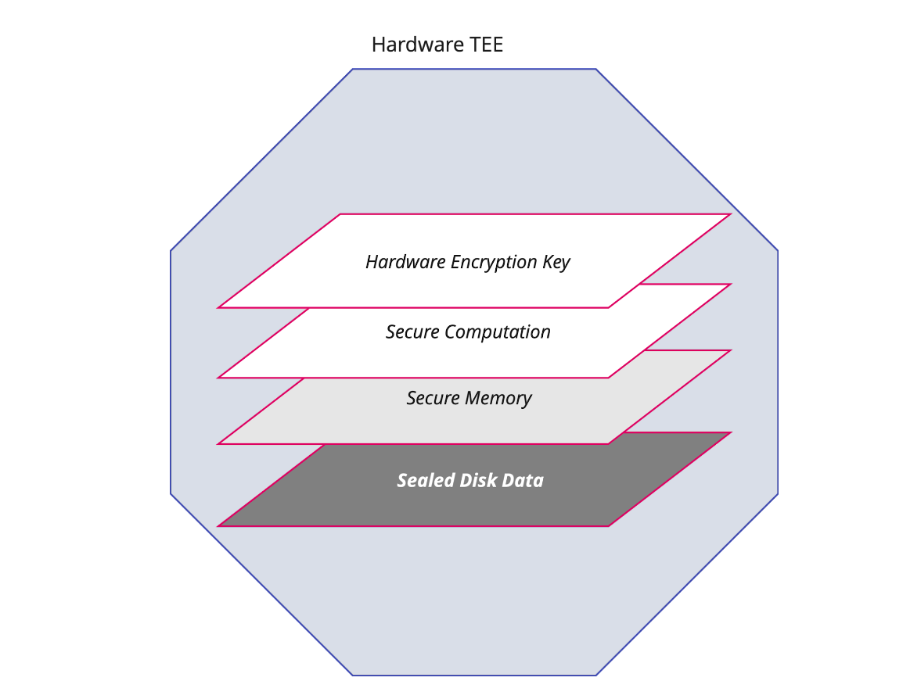
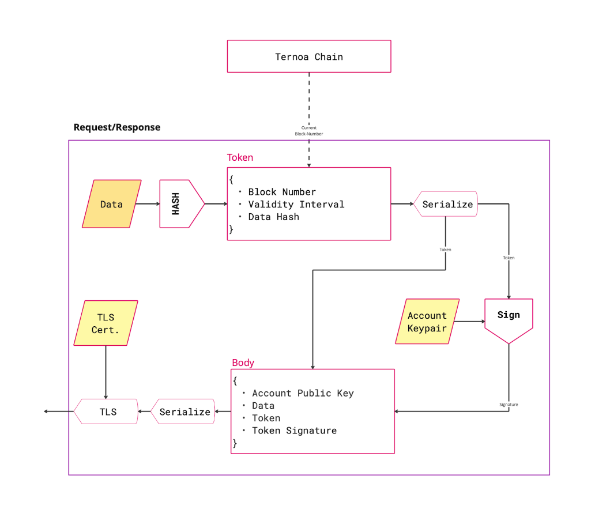
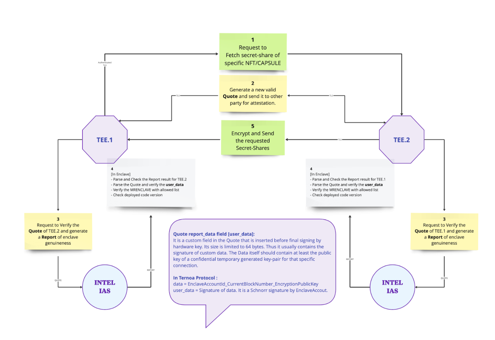

# Distributed Key Management

Security design to prevent unauthorized access to data starts with identifying the attack vectors. Here is the list of threats identified for design:
1. **Single point of attack/vulnerability:** Ternoa uses Shamir secret algorithm with (K, N) threshold decryption scheme, wherein the secret is split into N parts out of which K parts are needed to decrypt the secret. The split secrets called secret shares are stored across N secure enclaves running in Trusted Execution Environments, which are specialised hardware with built-in cryptographic identity and encryption capabilities.

2. **Compromised credentials:** To eliminate impact of any unauthorized access to the TEE-powered secret nodes through compromised credentials, the secret shares are sealed to persistent disk storage, using the built-in cryptographic keys from within the enclave. Even if unauthorized access is obtained to the encoded secret shares stored on the disk of the compromised hardware, it is pretty much useless as it cannot be decrypted without access to the private key of the TEE, which is embedded into the hardware.

3. **Secret Node operator shuts down service:** To address the scenario of the secret node operators shutting down the servers unilaterally, the Ternoa architecture is designed from the very beginning for decentralization of the secret nodes. Any operator can register on-chain to express interest to run the secret node. The on-chain technical council governance would vote to onboard operators after verification. Operators are required to bond a certain number of native chain tokens as security deposit, and the operator will be penalized in case of malicious behaviour of the operator or poor operational performance of the secret nodes. This ensures that the secret shares are not under the control of any single entity or operator. Even if a particular operator shuts down their service, other operators can take their place, and will be rewarded on-chain for their efforts.

4. **Secret Node operator with sudo access inspects VM memory to steal secrets:** TEEs execute programs in a protected area of memory that is not accessible even to administrators with root access.

5. **Man-in-the-Middle (MITM) Attacks:** The communication between the DApps and the enclaves can be eavesdropped or intercepted. To prevent this, data exchange with enclaves is secured by TLS with a few additional layers of security. The TLS certification generation and termination itself occurs inside the enclave, so the operator does not have access to the private keys of the TLS certificates. All requests to store or retrieve secret shares are signed with the private keys of the wallet of the owner of encrypted NFTs. 

6. **Replay attacks:** An extension of the MITM attacks is for an interceptor to capture and replay the request to the enclaves. To prevent this, an authentication token is sent that contains the block-number at which the signature was captured and also the validity interval. This prevents replay attack scenarios.

7. **Denial of service attacks or censorship by node operators:** Denial of service attacks on specific nodes or node operators refusing to serve requests for secret shares are addressed by having real-time multi-cluster replication of secret shares using P2P sync across enclaves. The following diagram shows the security and authentication mechanisms in place during P2P sync of key shares across registered enclaves. The authentication process includes remote attestation of requester and binary integrity checks enclave before secrets are shared.

8. **Malicious operator modifying the enclave code:** A secret node operator may choose to not deploy the original enclave binary from the releases repository, and decide to alter the code (Ternoa’s enclave cluster code is open source) to steal secrets. But the operator will be unsuccessful in this case as the measurement of the binary (MRENCLAVE) will not match the publicly available MRENCLAVE on the Github releases repository, and other enclaves will refuse to share secret shares with the maliciously installed binary.Further in such cases, the metrics server will flag this operator while submitting data on-chain, that will result in penalizing the operator and slashing the rewards and/or original token staked amount, based on the severity of the issue.

9. **Provable secure open-source deployment:** The deployments of the Ternoa enclaves are publicly verifiable by anyone , anywhere globally. Any user can request an attestation quote from any enclave, which can be sent to an attestation server to verify if the enclave binaries are indeed running on trusted hardware from Vendor. Likewise, the authorized enclave binary measurements (MRENCLAVE) are publicly available to inspect.

10. **Malicious operator can fake identity of enclave:** To prevent this, the enclave identity is established by generating key-pair inside the secure enclaves such that even the operator of the enclave will not have access to the signing key of the enclave.