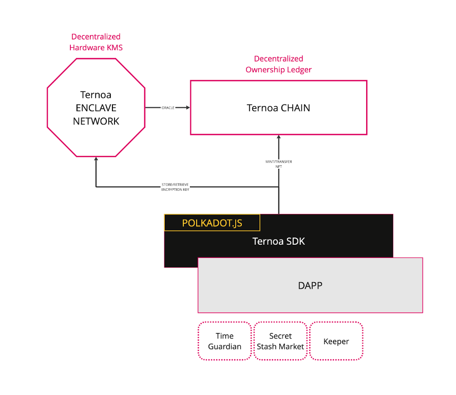
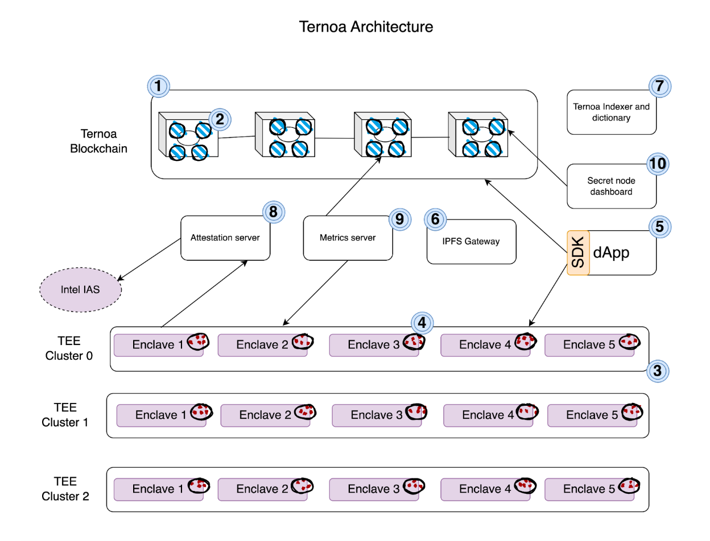

# Architecture

The Ternoa network is design to provide most advanced decentralized technologies for NFTs. That integrates Storage and Computing protocols.

Ternoa protocol is thinking to ensure true NFT's ownership by decentralizing key encryption management. Ternoa protocol handle key registration and re-encryption request from computing protocol.

**Ternoa protocol:** Secrets Keys will be stored in sealed state on Ternoa and Computing protocol by their own enclaves using TEE. Only enclave is the persistent owner of keys, EncKey of NFT content can be wiped from wallet owner after each upload/download. No individual or central entity, other than current owner, can access NFT Encryption Key.

**Storage Protocol:** The Storage Layer is a storage network that can be used to store encrypted privacy data. Currently, we support IPFS  (InterPlanetary File System) and Arweave as our decentralized storage network. Other storage networks on Polkadot ecosystem such as Crust will be available soon.

**Computing Protocol:** Key generation, Shamir Secret Sharing and Key agreement are executed in enclaves and keys will never be accessible outside of the enclave (i.e by Fat contract).

Fig. 1 - Overall ecosystem view

# Nominated Proof-of-Stake Definition

Ternoa is based on NPoS. The particularity of NPOS is based on a selection process of validators who are authorized to participate in the consensus protocol.
In NPoS, users are free to become validator candidates, or become nominators. Nominators approve of candidates that they trust and back them with their tokens, and once per era a committee of validators is elected according to the current nominators’ preferences.

# Nominators
Secure the Chain by selecting trustworthy validators and staking CAPS.
Nominators are CAPS-holders who contribute to the security of the network by economically backing (aka “nominating”) up to 16 validators of their choice with their tokens (aka “stake”). Nominators share part of the rewards earned by the validators in the active set that they nominated. It is important to note that nominators are also subject to slashing in case of misbehavior by one of their nominated validators.

# Validators

Secure the relay chain by staking CAPS, validating proofs from collators and participating in consensus with other validators.

They need to be responsive at all times and run secure, reliable infrastructure. Additionally, validators need tokens backing them, which incentivices them to abide by the rules since part of these tokens might be taken away otherwise (a concept called “slashing”). For their services, validators are paid in rewards denominated in the underlying network’s native token: CAPS.

# How NPoS Works

NPoS can be compared to an election and was inspired by the sequential Phragmen method, which was introduced in the late 19th century to optimize the election of a set of a given number of persons from a larger set of candidates. The objective of NPoS is to ensure decentralization and fair representation through proportional justified representation as well as high security through maximin support.

# Scalability

Various solutions exist to increase scalability of blockchain infrastructures, such as sharding, off-chain transactions, and layer-2 solutions, each aiming to increase the transaction throughput of the network. 

In our case, after observing builders’ behaviors and needs on generalist infrastructure blockchains, we came to the conclusion that 80% of the projects use the same 20% of possible features on any specific blockchain.

Our unique architecture focuses on reducing network congestion induced by suboptimal and redundant use of blockchain calls, by offering on-chain native primitives for the most sought after features. 

Most apps rely upon similar, standardized features and needs. On Ternoa, developers and app builders don’t need to code smart-contracts if they want to use these core features in their DApps.

Through our “Product Council”, Ternoa’s governance and community is in charge of identifying features in high demand, specifying then monitoring their implementation.

# Accessibility

The true potential of any technology lies in its accessibility and adaptability. For blockchain to enable widespread digital ownership, it must be accessible to the largest group of creators and developers in the web development community.

Making blockchain accessible means simplifying its integration into web applications, providing easy-to-use APIs, and offering comprehensive documentation and developer tools. By lowering the barriers to entry, more developers can incorporate blockchain-based features into their platforms, driving innovation and expanding the reach of blockchain-enabled digital ownership solutions.

Ternoa is designed to offer open-source web-ready development frameworks to developers, built directly upon protocole primitives. Unlike most web languages SDKs available on other protocols, Ternoa’s do not involve intermediate smart-contracts. Hence our frameworks for high-level developers do not imply any trade-offs in terms of decentralization and trust.

# Privacy
Key components of the Ternoa private data protocol include:
1. Layer 1 blockchain running on Polkadot technology
2. On-chain protocol that includes rules for state management and access of encrypted NFTs , on-chain registration for secret node operators, and rewards management
3. Secure enclaves running in Trusted Execution environments for distributed key management, organized in clusters that sync data among themselves in real-time for data redundancy,
4. In-enclave oracles to communicate keyshare receipt to blockchain.
5. Ternoa Javascript SDK to build DApps
6. Ternoa IPFS gateway to allow decentralized storage of encrypted private data
7. Ternoa indexer and dictionary for DApps to access historical on-chain data
8. Attestation server for remote attestation of enclaves
9. Metrics server to record performance of secret nodes and submit scores to blockchain
10. Dashboard for secret node operators to claim rewards

# Interoperability

Ternoa is built on Substrate. Therefore it's naturally interoperable with Polkadot ecosystem. We plan to become a Polkadot Parachain, which can serve the entire Polkadot Parachain ecosystem.

Substrate is a development environment created to facilitate the creation of Blockchains thanks to a modular architecture that allows to considerably reduce the development cost and time of a Blockchain.

The ecosystem formed by the Substrate and the Polkadot Blockchain stood out in 2020 as the first project not based on the Ethereum Blockchain to integrate Chainlink, a leading decentralized oracle network solution. And enabling it to become « the main provider of oracles for all Substrate-based blockchains and, ultimately, for the entire Polkadot network »

The Ternoa Blockchain is based on the substrate framework to offer:
- The use of delegated proof of stake (Nominated-Proof-of-Stake abbreviated to NPOS) to validate transactions and thus securing the data.
- The possibility to connect to other Blockchains to be able to store the data on specialized infrastructures.
- The creation of Smart Contracts in order to create the different protocols allowing data to be transmitted/to transmit the data.
- The management of Non-Fungible Tokens (NFT) which acts as a time capsule and allows the management of time capsules;

# The importance of multi-chain
Blockchains, because of their necessary overhead for things like consensus and encryption, suffer from congestion and slow transactions times. This results in higher transactions fees, poor user experience and ultimately lower user adoption.

For blockchain technology to become widely adopted, blockchains must become faster. One good way to speed things up is to develop purpose-built blockchains, rather than try and build dApps and smart contract on a do-it-all blockchain like Ethereum.

Because it only has to do one thing, targeted protocols can be developed on a purpose-built blockchain which are designed to optimize throughput. Purpose-built blockchains sound like the ideal solution, but they too come with a big hurdle.

Purpose-built blockchains are not natively interoperable. That means an ecosystem of purpose-built blockchains would be an ecosystem of blockchains that can’t talk to each other. Perhaps the one impediment to user adoption worse than slow blockchains are blockchains that don’t communicate with each other. For an blockchain ecosystem to work, the individual blockchains must be interoperable and form a cohesive user experience.

# Smart Contracts

Ternoa is providing the benefit to write smart contracts on the chain. Solutions like ink! or EVM could be use to implement smart contracts in easy way.

- With ink! you can write smart contracts in Rust for blockchains built on the Substrate framework.

# Why Rust is an ideal smart contract language

It is type safe, memory safe, and free of undefined behaviors. It generates small binaries because it doesn’t include extra bloat, like a garbage collector, and advanced optimizations and tree shaking remove dead code. Through compiler flags, Rust can automatically protect against integer overflow.

- **Rust ecosystem:** You gain from all of support available to the Rust ecosystem for free. As the language develops, new features and functionality, improving how you can write smart contracts in the future.
- **Tooling:** Tools like rustfmt, clippy and rust-analyzer already work out of the box. Same goes for code formatting and syntax highlighting in most modern text editors. Also Rust has an integrated test and benchmark runner,
- **No overhead:** Minimal runtime.
- **Safe & Efficient:** Zero-cost & safe abstractions.
- **Productive:** Cargo + crates.io Ecosystem.
- **1st class Wasm:** Rust provides the first class support for the WebAssembly.
- **Small Size:** In the space-constrained blockchain world size is important. The Rust compiler is a great help for that, since it reorders struct fields in order to make each type as small as possible. Thus Rust data structures are very compact, in many cases even more compact than in C.

